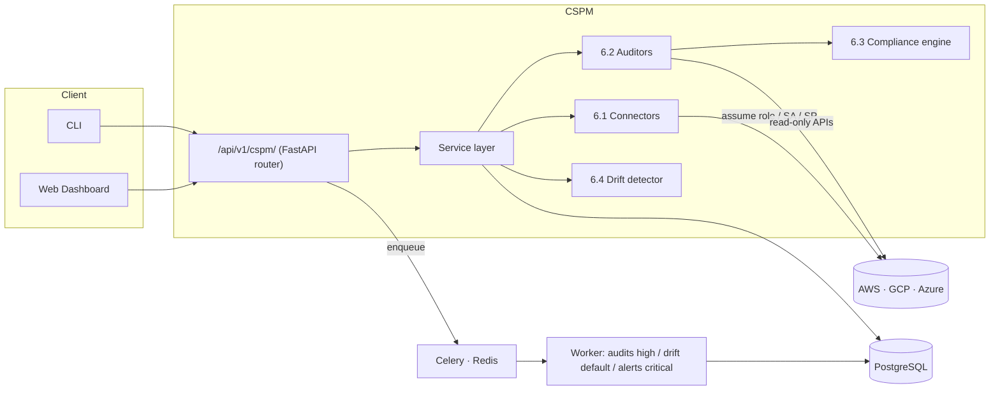

<div align="center">

# 🛡️ Cloud Security Posture Manager (CSPM)

### Continuously audit your **AWS · GCP · Azure** accounts against CIS Benchmarks and security best practices — and catch misconfigurations before attackers do.

[](https://github.com/nisargdedakiya/cloud-security-posture-manager-cspm-/actions/workflows/ci.yml)


**Read-only · Non-intrusive · Multi-cloud · Compliance-aware**

</div>

---

## ✨ What it does

CSPM connects to your cloud accounts with **least-privilege, read-only** credentials,
enumerates your resources, and runs a suite of security checks — then maps every
finding to the compliance frameworks your auditors care about and watches for
configuration **drift** over time. It **never modifies** your cloud resources.

> **Tool 6** of the Track 2 SaaS Security Platform. It is not standalone — it mounts
> as a router at `/api/v1/cspm/` on the shared platform backend (auth, orgs, billing,
> audit log, reports). Those shared pieces are represented here by swappable stubs.

<div align="center">

| | |
|---|---|
| 🔌 **Connect** | AWS (STS AssumeRole + external id), GCP (service account), Azure (service principal) |
| 🔎 **Audit** | **37 native checks** (AWS 23 · GCP 7 · Azure 7) + **Prowler ingest** (hundreds more) — IAM/MFA, S3, EC2/EBS, VPC flow logs, RDS, KMS, CloudTrail, Secrets Manager, GuardDuty, GCP buckets/SQL/audit-logs, Azure storage/NSG/KeyVault… |
| 📊 **Comply** | CIS AWS v2 · SOC 2 · ISO 27001 · PCI DSS v4 — per-framework scores + evidence export |
| 🌊 **Detect drift** | Baseline snapshots + structural deep-diff; approve or reject each change |
| 🔐 **Secure** | AES-256-GCM encrypted credentials, RBAC, immutable audit log, request tracing |

</div>

---

## 🏗️ Architecture



**Flow:** a connector validates credentials → the service layer runs the right
auditor → each `check_*` method emits a `Finding` → findings are persisted,
deduplicated, scored against compliance frameworks, and drift is compared against
an approved baseline.

---

## 📦 Modules (spec build order)

| # | Module | Package | Highlights |
|---|--------|---------|------------|
| **6.1** | Cloud Account Connector | `cspm/connectors/` | Least-privilege validation; **AES-256-GCM** encrypted secret storage; AWS external-id (confused-deputy defense) |
| **6.2** | Security Audit Engine | `cspm/auditors/` | Class-based, independently-testable `check_*` methods; `AWSAuditor` + `GCPAuditor` + `AzureAuditor` |
| **6.3** | Compliance Mapping Engine | `cspm/compliance/` | check → CIS/SOC2/ISO27001/PCI-DSS controls; per-framework scoring; evidence export; remediation priority |
| **6.4** | Drift Detection | `cspm/drift/` | JSONB baselines + `deepdiff`; security-sensitive changes flagged; approve/reject workflow |

---

## 🚀 Quick start

### Option A — zero credentials (see the whole pipeline)

```bash
pip install -e ".[dev]"

cspm --demo                 # full audit against an in-memory fake AWS account
cspm --demo --format json   # machine-readable output
```

<details>
<summary>📟 Sample output</summary>

```
========================================================================
  AWS SECURITY AUDIT — Tool 6 CSPM
========================================================================
  Findings: 25
  Compliance scores:
    cis_aws_v2       0.0%  (0/13 controls)
    soc2             0.0%  (0/13 controls)
  ----------------------------------------------------------------------
  [CRITICAL] Root account MFA not enabled
  [HIGH    ] S3 Public Access Block Not Fully Enabled  arn:aws:s3:::public-bucket
  [HIGH    ] Security group allows 0.0.0.0/0 to SSH    us-east-1/sg-open
  [CRITICAL] RDS instance is publicly accessible       us-east-1/prod-db
```
</details>

### Option B — the web app

```bash
uvicorn cspm.api.app:app --reload
# open http://127.0.0.1:8000
#   1. Sign in (Dev/Org mode → org "demo-org", role admin)
#   2. Cloud Accounts → "✨ Load demo data"  (populates findings without cloud creds)
#   3. Explore Overview, Findings, Compliance, Drift, API Keys
```

The bundled single-page app (in `web/`, dependency-free) is a full product UI:
an **Overview** dashboard with charts, **Cloud Accounts** management (connect
AWS/GCP/Azure), a **Findings** explorer with remediation snippets, **Compliance**
scores + trend lines, **Drift** review (approve/reject), and **API Key**
management. It authenticates via dev headers, a JWT, or an API key.

### Option C — full stack (Docker)

```bash
export CSPM_ENCRYPTION_KEY=$(python -c "from cspm.security.crypto import generate_key; print(generate_key())")
docker compose up --build
# API on :8000 · Postgres · Redis · Celery worker · migrations run automatically
```

---

## 🪟 Running on Windows

**Docker is NOT required.** CSPM runs natively on Windows with just Python — Docker
is only a convenience for the full Postgres + Redis + worker stack.

### Native (no Docker) — recommended for dev / demo / single-node

```powershell
# 1. Install Python 3.11+ from python.org (tick "Add to PATH")
python --version

# 2. Clone and create a virtual environment
git clone https://github.com/nisargdedakiya/cloud-security-posture-manager-cspm-.git
cd cloud-security-posture-manager-cspm-
python -m venv .venv
.\.venv\Scripts\Activate.ps1

# 3. Install
pip install -e ".[dev]"

# 4. Persist data to a file (default is in-memory and resets on restart)
$env:CSPM_DATABASE_URL = "sqlite+pysqlite:///./cspm.db"

# 5. Run the web app
uvicorn cspm.api.app:app --reload
#    → open http://127.0.0.1:8000  (sign in demo-org/admin, "Load demo data")

# …or the CLI
cspm --demo
```

That's the **entire** product — dashboard, scans, findings, compliance, drift,
billing — running on Windows with **no Docker, no Postgres, no Redis**.

**When do you need more?**

| You want… | Add | Docker helps? |
|---|---|---|
| Dashboard, scans, compliance, billing (SQLite) | nothing | ❌ not needed |
| Background/scheduled scans via Celery | **Redis** | ✅ easiest via Docker |
| Production database | **PostgreSQL** | ✅ easiest via Docker |
| One-command prod-like stack | — | ✅ `docker compose up` |

On native Windows keep `CSPM_EAGER_TASKS=true` (the default) so scans run
in-process — then **Redis/Celery aren't required at all**. Redis has no official
native Windows build, so if you want background workers, Docker Desktop (or WSL2)
is the simplest path.

### With Docker Desktop (prod-like)

Install **Docker Desktop for Windows**, then in PowerShell:

```powershell
$env:CSPM_ENCRYPTION_KEY = (python -c "from cspm.security.crypto import generate_key; print(generate_key())")
docker compose up --build
```

This brings up API + Celery worker + Postgres + Redis with migrations applied.

---

## 🌐 API surface (`/api/v1/cspm/`)

| Method | Path | Description |
|--------|------|-------------|
| `POST` | `/accounts` | Connect a cloud account |
| `GET` | `/accounts` | List connected accounts *(paginated)* |
| `POST` | `/accounts/{id}/validate` | Re-validate credentials |
| `DELETE` | `/accounts/{id}` | Disconnect *(admin)* |
| `POST` | `/accounts/{id}/scan` | Trigger an audit |
| `GET` | `/scans/{scan_run_id}` | Scan run status |
| `GET` | `/findings` | List findings *(filter by severity/status/account)* |
| `PATCH` | `/findings/{id}` | Update finding status |
| `GET` | `/compliance/{framework}` | Compliance score + detail |
| `GET` | `/compliance/{framework}/evidence` | Evidence export |
| `GET` | `/drift` | List drift events |
| `POST` | `/drift/{id}/approve` | Approve drift (updates baseline) |
| `POST` | `/drift/{id}/reject` | Mark as violation (creates finding) |

Every request is **org-scoped** via `X-Org-Id`; mutations are **RBAC-gated** via
`X-Role` (`viewer` / `analyst` / `admin`) — the seam where the shared JWT/SSO auth
is wired in.

---

## 🏢 Enterprise features

| Area | What's included |
|------|-----------------|
| **SSO / Auth** | OIDC/JWT (Okta, Azure AD, Auth0, Cognito) via JWKS or HS256; **API keys** for automation; **SCIM 2.0** user provisioning; DB-backed RBAC from `org_memberships` |
| **Secrets** | Envelope encryption with pluggable key providers — **AWS KMS**, **HashiCorp Vault**, or env — with key rotation and legacy-ciphertext compatibility |
| **Tenant isolation** | App-side org scoping **+ Postgres Row-Level Security** so a query bug can't leak cross-tenant data |
| **Audit integrity** | Immutable, **hash-chained** audit log; `GET /audit/verify` detects any tampering |
| **Scale** | AWS **Organizations** multi-account fan-out, region auto-discovery, concurrency caps, adaptive throttling backoff |
| **Breadth** | Native curated checks **+ Prowler adapter** to ingest 1000+ open-source checks |
| **Integrations** | Slack, generic webhook, PagerDuty alerting (severity-gated) |
| **Remediation** | Terraform + AWS CLI fix snippets per finding (`GET /findings/{id}/remediation`) |
| **Scheduling** | Celery Beat: continuous drift sweeps + nightly retention purge |
| **Reporting** | CSV export + compliance **trend** time series per framework |
| **Observability** | Prometheus `/metrics`, request tracing, Sentry + OpenTelemetry hooks |
| **Governance** | Configurable data-retention windows (GDPR/residency), per-client rate limiting |
| **Deploy** | Helm chart with HPA, non-root hardened containers; CI with ruff, pytest, **Trivy** scan + **SBOM** |

See [`.env.example`](.env.example) for every configuration knob.

## 💳 Subscriptions & plans

CSPM is a monetizable SaaS: features and usage are gated by subscription tier,
billed through Stripe (or set manually for self-hosted/enterprise contracts).

| | Free | Starter · $49/mo | Pro · $299/mo | Enterprise |
|---|---|---|---|---|
| Cloud accounts | 1 | 3 | 15 | ∞ |
| Scans / month | 10 | 100 | 1,000 | ∞ |
| Frameworks | CIS AWS | + SOC 2 | All | All |
| Drift detection | — | ✅ | ✅ | ✅ |
| Multi-cloud (GCP/Azure) | — | — | ✅ | ✅ |
| Integrations, evidence, trends, Prowler | — | — | ✅ | ✅ |
| API keys | — | 2 | 10 | ∞ |
| SSO / SCIM, RLS, priority support | — | — | — | ✅ |

- **Enforcement**: gated endpoints return **HTTP 402** with an `upgrade_to` hint;
  the web app turns that into a "🔒 upgrade" prompt. Limits (accounts, scans/mo,
  API keys) are metered per org.
- **Billing endpoints**: `GET /billing/plans`, `GET /billing/subscription`
  (with live usage), `POST /billing/checkout`, `POST /billing/portal`,
  `POST /billing/webhook`.
- **Modes** (`CSPM_BILLING_MODE`): `stripe` (Checkout, Billing Portal, Customers,
  invoices, full webhook sync), `razorpay` (INR-friendly subscriptions +
  HMAC-verified webhooks — for Indian customers), or `manual` (default; flips
  plans directly — handy for dev and negotiated deals). A billing facade
  (`cspm/billing/gateway.py`) dispatches to the configured provider.
- The Stripe path is fully covered by tests using an injected fake SDK
  (`tests/test_stripe_gateway.py`) — going live only needs your account keys +
  price IDs (see `docs/business/pricing-and-company.md`).
- Plans are defined in one place — `cspm/billing/plans.py`.

## 🔐 Security model

- **STS AssumeRole with a per-org external id** to prevent the confused-deputy problem.
- Cloud secrets (AWS keys, GCP SA JSON, Azure client secret) are **AES-256-GCM
  encrypted at rest** and **never returned to the frontend**.
- Validation uses the cheapest possible read-only call per provider.
- Every mutating action is written to an **immutable audit log**.
- Production config **fails fast** if the encryption key / Postgres / async tasks
  aren't set (`CSPM_ENV=production`).

---

## ✅ Compliance frameworks

<div align="center">

`CIS AWS Foundations v2` · `CIS GCP v2` · `CIS Azure v2` · `SOC 2` · `ISO 27001` · `PCI DSS v4`

</div>

Each check maps to one or more controls. The score is
`checks_passed / checks_applicable` per framework, and the evidence export lists
each control's pass/fail with the offending resource and a timestamp — ready for
your auditors.

---

## 🧰 Tech stack

**Python 3.11** · **FastAPI** · **SQLAlchemy 2.0** + **Alembic** · **PostgreSQL** ·
**Celery** + **Redis** · **boto3 / google-auth / azure-identity** · **deepdiff** ·
**cryptography** · **pytest** · **ruff**

---

## 🗂️ Project layout

```
cspm/
├── config.py          env-driven settings + prod guards
├── db.py              SQLAlchemy engine / session / Base
├── models.py          ORM for cspm_* tables (spec Section 4)
├── schemas.py         Pydantic I/O (secrets never serialized)
├── security/crypto.py AES-256-GCM field encryption
├── logging_config.py  structured JSON logging + request ids
├── shared/            stubs for the shared platform (orgs, users, auth, audit)
├── connectors/        6.1  cloud account connectors
├── auditors/          6.2  AWS / GCP / Azure audit engines
├── compliance/        6.3  mappings + scoring + evidence
├── drift/             6.4  deepdiff drift detector
├── service.py         orchestration shared by API + Celery
├── tasks.py           Celery tasks (high / default / critical queues)
├── api/               router, app, middleware, pagination
├── cli.py             audit CLI (--demo for no-credential runs)
└── fakes.py           in-memory fakes for demos/tests
web/                   dashboard (HTML/CSS/JS)
alembic/ · migrations/ database migrations
tests/                 49 tests across every module
```

---

## 🧪 Development

```bash
pip install -e ".[dev]"
pytest -q                 # run the suite (49 tests)
ruff check cspm tests     # lint
```

### Adding a check

Subclass the auditor pattern — each check is an independently-testable method
returning `list[Finding]`:

```python
def check_my_rule(self) -> list[Finding]:
    findings = []
    for resource in self.session.client("s3").list_buckets()["Buckets"]:
        if not compliant(resource):
            findings.append(Finding(
                resource=resource["Name"],
                check="My rule title",
                check_id="aws_my_rule",
                severity="high",
                remediation="How to fix it.",
            ))
    return findings
```

---

## 🚦 Product readiness (honest status)

What it takes to go from "strong build" to "branded product a company relies on":

| Layer | Status | Where |
|---|---|---|
| **Working core** | ✅ built + **moto-validated** against real boto3 shapes | `tests/test_moto_integration.py` |
| **Check breadth** | ✅ native checks **+ Prowler ingest** (hundreds) | `POST /accounts/{id}/prowler-ingest` |
| **Brand** | ✅ name, logo, landing page, positioning | `web/landing.html`, `docs/brand/` |
| **Trust (docs)** | ✅ SECURITY / Privacy / Terms / SOC2 & pentest checklists | `SECURITY.md`, `web/legal/`, `docs/legal/` |
| **Trust (attestation)** | ⏳ needs a **real** third-party SOC 2 audit + pen-test | checklists provided |
| **Business** | ✅ pricing + Stripe go-live + company checklists · ⏳ real Stripe/LLC need you | `docs/business/` |
| **GTM** | ✅ pilot plan, one-pager, outreach templates · ⏳ real customers need you | `docs/gtm/` |
| **Ops** | ✅ Helm/HPA, metrics, runbook, SLA template · ⏳ real deploy + on-call need you | `docs/ops/`, `deploy/helm/` |

Marketing site: `web/landing.html` → served at `/static/landing.html`.

## 🗺️ Roadmap

Done in recent iterations:

- [x] OIDC/JWT + API keys + SCIM + DB-backed RBAC
- [x] KMS/Vault key providers with rotation
- [x] Postgres RLS tenant isolation + hash-chained audit log
- [x] AWS region auto-discovery + Organizations multi-account + backoff
- [x] Prowler adapter for check breadth
- [x] Slack/webhook/PagerDuty alerting
- [x] Celery Beat drift schedule + retention purge
- [x] CSV export + compliance trends
- [x] Prometheus metrics, rate limiting, Helm/HPA, Trivy + SBOM in CI

Still ahead:

- [ ] Live GCP/Azure collectors (SDK plumbing behind the proven interfaces)
- [ ] PDF evidence export via the shared reports (Tool 3) pipeline
- [ ] Jira/ServiceNow ticketing + Splunk/Sentinel SIEM export
- [ ] Redis-backed distributed rate limiting
- [ ] Guarded auto-remediation (one-click apply with approvals)

---

<div align="center">
<sub>Part of the Track 2 SaaS Security Platform · Phase 2, Build Order #2</sub>
</div>
