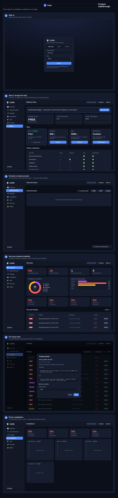

# Product Walkthrough

A six-step visual tour from sign-in to compliance evidence. Drop the image into
onboarding emails, the landing page, or a sales deck.

**Steps captured:**
1. **Sign in** — org / SSO / API key.
2. **Start a 14-day Pro trial** — one click, no credit card; unlocks all frameworks, multi-cloud & drift.
3. **Connect a cloud account** — one-click read-only AWS role (CloudFormation).
4. **See your posture instantly** — severity donut, compliance scores, top risks.
5. **Fix issues fast** — copy-paste Terraform / CLI remediation per finding.
6. **Prove compliance** — per-framework scores, trends, evidence export.

Regenerate after UI changes with `scratchpad/walkthrough.py` (drives a live
server + headless browser and stitches the steps into `web/assets/walkthrough.png`).
